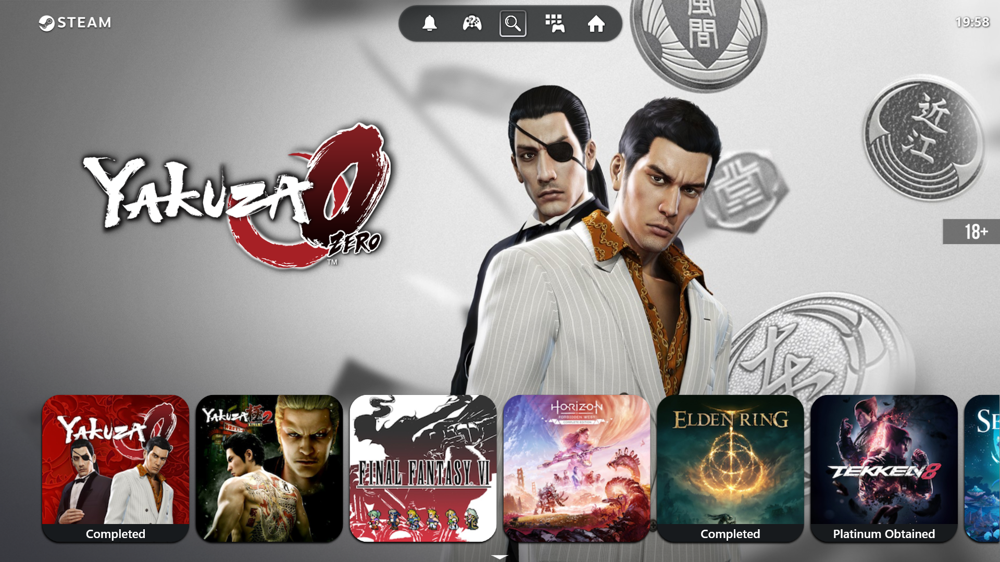
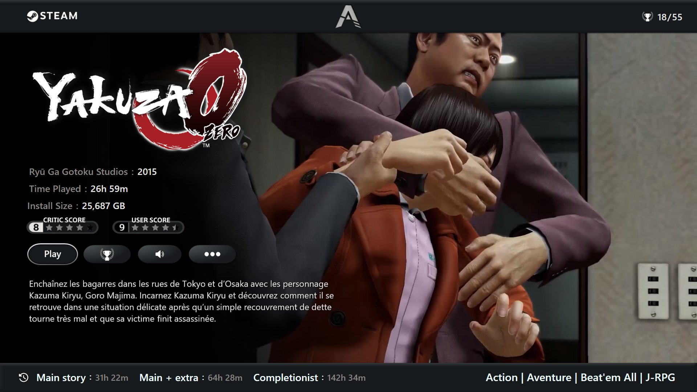
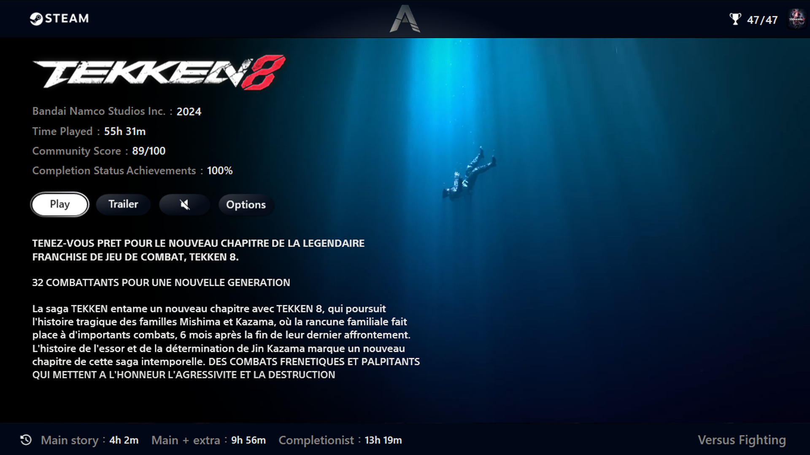

# Aniki-ReMake
Fullscreen Theme for Playnite

__________________________________________________________________________

To fully utilize this theme, follow these setup instructions :

Remove the startup warning message:

    1.Open the zip file from the folder [Aniki Theme\Theme Option\4.Main No Warning Message].
    2.Extract its contents into the main theme folder.
    3.You can now adjust the cover size as you like.

Customize the interface:

    1.In the folder [Aniki Theme\Theme Option\2.Interface], choose the style you like from the "Preview" folder.
    2.Open the corresponding Zip file, then copy and paste its contents into the main theme folder.
  
Customize filter icons (those located at the bottom of the screen):

    1.Open the folder [Aniki ReMake\Icons\Filter].
    2.Choose (or add) a .png file, then rename this .png file with the name corresponding to your filters (for example, "My Games.png" for the filter "My Games").

Customize source icons (those located at the top of the screen):

    1.Open the folder [Aniki ReMake\Icons\Source] and follow the same instructions as for the filter icons.

Change your avatar:

    1.Go to the folder [Aniki ReMake\Theme Option\Avatar].
    2.Select the desired avatar or import your own.
    3.Rename it "Avatar.png" and replace the file of the same name in the folder [Aniki ReMake\Images].

Modify navigation audio files:

    1.Go to the folder [Aniki ReMake\Audio].
    2.Rename your file exactly like the one you want to replace. To disable these sounds, rename or delete the audio files.

Modify or Delete Status on Game Cover:

	1.In desktop mode, click on playnite's icone in the top left-hand corner, then on library/Lybrary Manager (or with CTRL+W).
 	In the list that appears, choose "completion statuses". 
 	2.Here you can add or modify game statuses; if you don't want to display any statuses, simply delete all the statuses.
 	3.I advise you to create your own status, then you can modify the status of a game from fullscreen.
___________________________________________________________________________

Before you begin, make sure to have the following Add-on installed for an optimal theme experience.

To download them, go to settings by clicking on the Playnite icon shaped like a controller, located at the top left. Then, select "Add-on" and go to the "Browse" tab at the bottom to search for the extensions.

Recommended extensions:

	Generic:

    		-ExtraMetadataLoader (For Game Trailer and Logo).
    		-ExtraMetadataLoader Fullscreen Helper (For ExtraMetada Works in Fullscreen mode).
    		-How Long To Beat (To have enough time to finish the game).
    		-SuccessStory (To get the game's achievements).
    		-PlayniteSound Mod by Ashpynov (To have personalized interface sounds + different music for each game + Pause the music when a trailer is playing and during the 		theme intro video).
      		-BackToGame (Provides a button that returns focus to the game when it loses focus).

	Metadata Source:

   		Universal PSN Metadata (To automatically download game covers in square format and wallpapers adapted to the theme with characters on the right of the screen)

___________________________________________________________________________

Recommended settings:

In Desktop Mode:

-For wallpapers and covers:

	Access the settings by clicking on the Playnite icon shaped like a controller, at the top left.
	Select "Settings."

	Go to the "Metadata" tab and choose "PSN Store" in the settings for "Covers" and "Background Image." For other elements, choose the metadata source that suits you.

	Next, go to the "Appearance/Grid view" and set the "Target aspect ratio" to 1:1.

	Save the changes using the "Save" button at the bottom of the window.

-For logos:

	Access the settings by clicking on the Playnite icon shaped like a controller, at the top left.

	Go to "Add-on/Generic/Extra Metadata Loader/Logo Settings."
	In the "logo loader" settings, set the following values:

    		Maximum Width: 600
   		Maximum Height: 320

-For Trailer :

	For the "Trailer" button to work, video preview must be deactivated.
	Access the settings by clicking on the Playnite joystick icon in the top left-hand corner.
	Go to "Add-on/Generic/Extra Metadata Loader/Video settings" and uncheck the "Show video preview when video is not playing".

In Full-Screen Mode:

	Access the settings by clicking on the gear-shaped icon at the top right.
	In the "Layout" section, choose "8" for the number of columns and "25" for spacing to achieve a balanced appearance.
___________________________________________________________________________
Enjoy your gaming experience!
___________________________________________________________________________

If you want to buy me a coffee : https://ko-fi.com/mikeaniki
